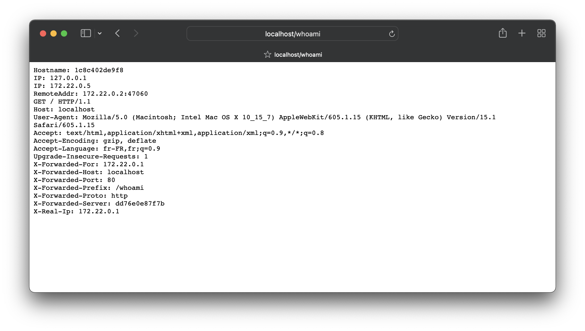
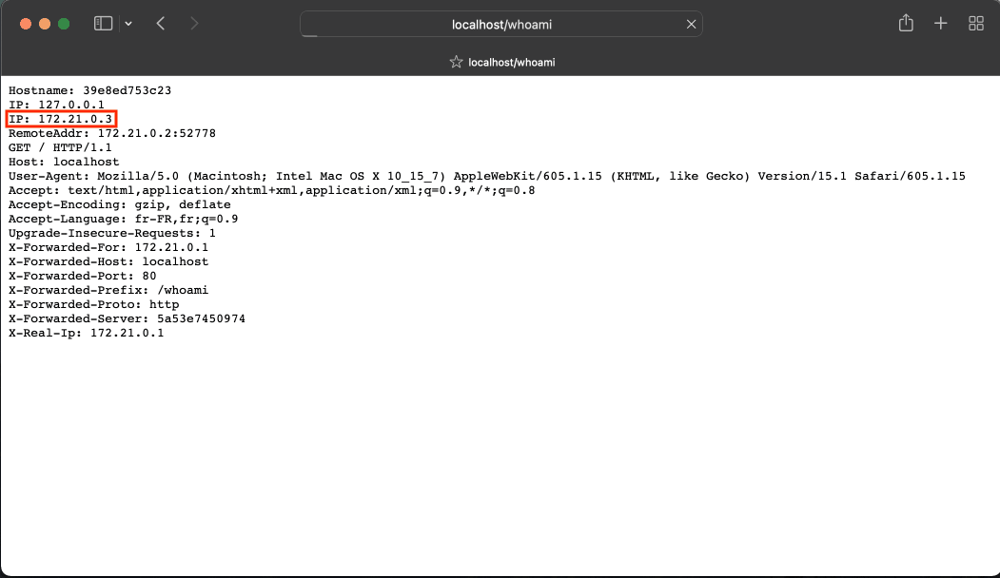
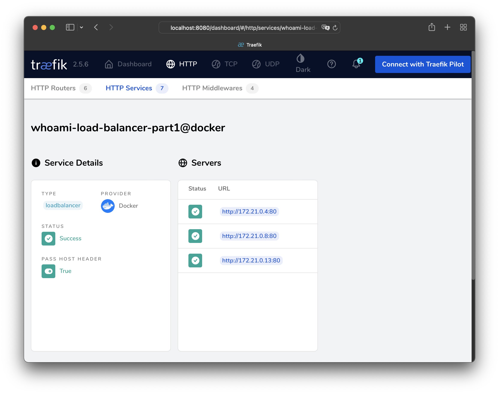
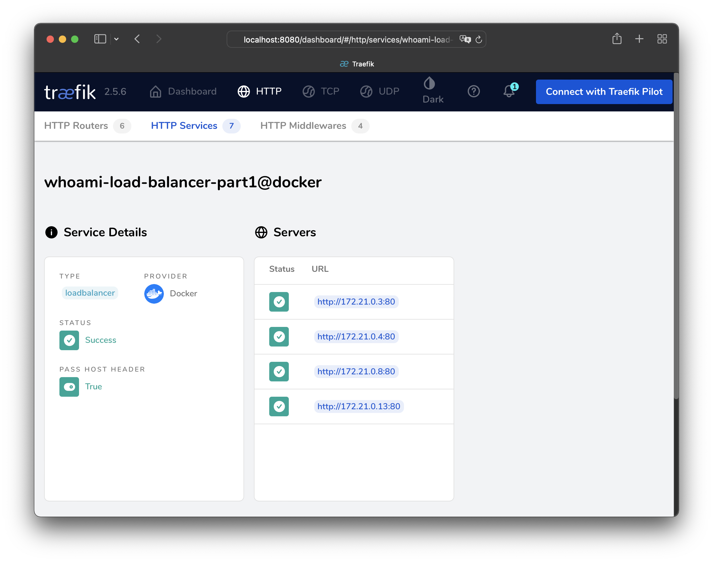

# Labo HTTP Infra

## Load balancing: avec plusieurs serveurs noeuds

Hadrien Louis & Théo Mirabile

| ⚠ Cette partie utilise Traefik. Pour savoir comment nous l'avons installé / configuré, se rendre [à cette partie](https://github.com/theomi/API-2021-HTTP-Infra/tree/master/traefik) |
| ------------------------------------------------------------------------------------------------------------------------------------------------------------------------------------ |

## Introduction

L'intérêt du _load balancing_ (équilibrage des charges) est qu'il est facile d'adapter le nombre de serveurs HTTP au nombre de requêtes client, et ce en temps réel. De plus, cela permet de prévenir l'indisponibilité du service en cas de panne d'un serveur, car le système de load balancing va aiguiller les requêtes vers un autre serveur disponible.

Dans ces deux parties additionnelles, nous mettons en œuvre deux manières de déterminer sur quel serveur la requête est aiguillée :

- le _round-robin_, qui va attribuer tour à tour chaque requête à un serveur différent, et ce de manière cyclique (deux requêtes consécutives d'un même client vont donc être attribuées à deux serveurs HTTP distincts)
- le _sticky session_, qui, par le biais d'un cookie, va attribuer un serveur HTTP fixe à chaque client. Deux requêtes consécutives de ce même client seront donc traitées par le même serveur HTTP.

Dans les deux cas, si le serveur censé traiter la requête n'est plus disponible, le _load balancer_ va sélectionner un serveur alternatif pour traiter cette requête.

## Utilisation de `whoami`

Afin de faciliter les tests du bon fonctionnement de l'infrastructure, nous avons décidé d'utiliser l'image `traefik/whoami` qui consiste en un serveur HTTP basique qui, à chaque requête, retourne les en-têtes détaillés de cette dernière.
Voici un exemple d'utilisation :


Pour la suite de cette partie, nous allons donc démarrer plusieurs instances de whoami en parallèle, puis effectuer des requêtes. Cela permettra de voir sur quelle instance la requête a été aiguillée.

## Mise en place

Commençons par ajouter un nouveau service à notre fichier `docker-compose.yml` :

```
  # On nomme le service "whoami"
whoami:
    image: traefik/whoami # On demande à utiliser l'image de whoami
    restart: always       # Configure le redémarrage automatique
    depends_on:
      - reverse-proxy   # Le service n'est lancé qu'après le reverse proxy
    networks:
      - net-rproxy        # On ajoute le service au même réseau Docker
```

De plus, nous devons ajouter les `labels` liés à Traefik, comme expliqué dans la partie précédente. La configuration finale est la suivante :

```
  whoami:
    image: traefik/whoami
    restart: always
    labels:
      - traefik.enable=true
      - traefik.http.routers.whoami.rule=Host(`localhost`) && PathPrefix(`/whoami`)
      - traefik.http.routers.whoami.middlewares=whoami-stripprefix
      - traefik.http.middlewares.whoami-stripprefix.stripprefix.prefixes=/whoami
      - traefik.http.routers.whoami.entrypoints=web
    depends_on:
        - reverse-proxy
    networks:
      - net-rproxy
```

## Scalabilité des instances

Grâce à Docker compose, il est très facile de créer des instances multiples d'un même service en utilisant l'option `--scale` dans la commande de lancement.

Dans le cadre de ce laboratoire, nous avons décidé de créer 4 instances de whoami.

## Round-robin par défaut

En faisan des recherches sur [le site web de Traefik](https://traefik.io/blog/traefik-2-0-docker-101-fc2893944b9d/) on tombe sur cette mention :

> The LoadBalancer type is a round robin between all the available instances (called server).

Cela signifie que si l'on démarre plusieurs instances du même service, le round robin sera utilisé par Traefik pour répartir les charges. C'est une bonne nouvelle, car cela veut dire que le round robin sera opérationnel sans configuration supplémentaire.

## Résultat obtenu

Pour le test, nous avons lancé notre docker-compose avec 4 instances de chaque service (serveur web, application express et serveur de test whoami\*) :

```sh
docker-compose up -d --scale web=4 --scale express=4 --scale whoami=4
```

Si l'on va ensuite sur l'adresse définie pour _whoami_ qui est donc `http://localhost/whoami` et que l'on actualise la page plusieurs fois, on remarque que l'adresse IP du serveur change à chaque requête, et ce de manière circulaire entre les quatre instances. Le Round Robin fonctionne.



## Arrêt et démarrage manuel d'une instance

- Si l'on arrête manuellement une des instances de `whoami`, on remarque que l'instance en question a disparu de Traefik, et le Round Robin ne s'effectue plus que sur les 3 instances restantes.



- En relançant l'instance en question, on remarque qu'elle réapparaît dans la liste. De plus, le Round Robin fonctionne à nouveau sur les 4 instances.


