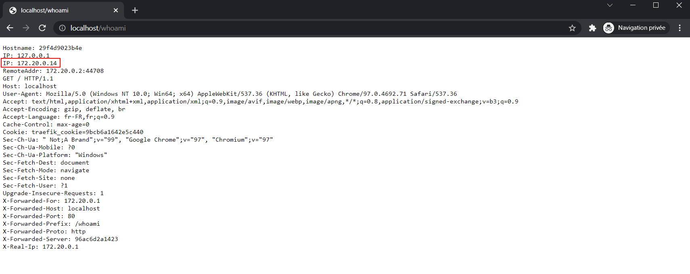
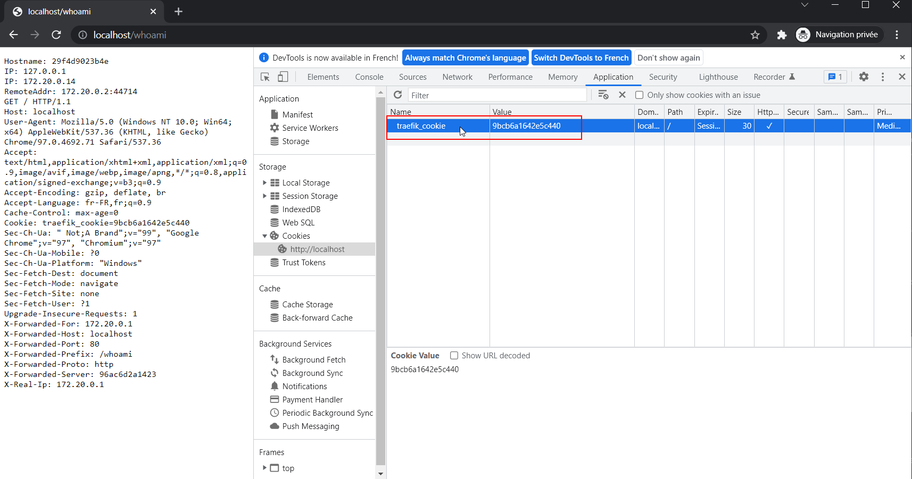
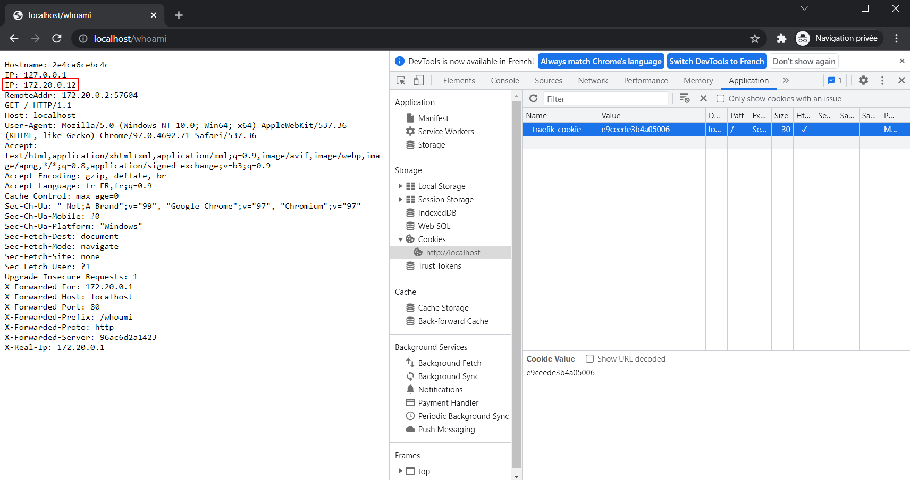

# Labo HTTP Infra

## Load balancing: round-robin vs sticky sessions

Hadrien Louis & Théo Mirabile

| ⚠ Cette partie utilise Traefik. Pour savoir comment nous l'avons installé / configuré, se rendre [à cette partie](https://github.com/theomi/API-2021-HTTP-Infra/tree/master/traefik) |
| - |

## Introduction

Dans cette partie, nous mettons en œuvre le _sticky session_, qui, par le biais d'un cookie, va attribuer un serveur HTTP fixe à chaque client. Deux requêtes consécutives de ce même client seront donc traitées par le même serveur HTTP.

Dans le cas ou un serveur censé traiter la requête n'est plus disponible, le _load balancer_ va sélectionner un serveur alternatif pour traiter cette requête.

## Installation

Comme pour l'étape précédente, nous avons utilisé le container `traefik/whoami` qui consiste en un serveur HTTP basique qui, à chaque requête, retourne les en-têtes détaillés de cette dernière.

Pour configurer le sticky session dans Traefik, il est nécessaire d'ajouter les labels suivants dans le `docker-compose` de chaque service. Dans notre cas, nous les avons ajoutés pour les services : `whoami` et `web`. 

Les lignes suivantes ont été ajoutées pour chaque service :

```yml
- traefik.http.services.whoami.loadbalancer.sticky=true
- traefik.http.services.whoami.loadbalancer.sticky.cookie.name=traefik_cookie
- traefik.http.services.whoami.loadbalancer.sticky.cookie.httpOnly=true
```

Ces instructions vont donc indiquer d'activer le sticky session et vont donner un nom au cookie. Rien de plus n'est à faire


## Résultat obtenu

Une fois le `docker-compose` lancé, nous allons vérifier que le load balancer en mode sticky session fonctionne bien. Pour ce faire, nous allons utiliser notre container `whoami`. Il suffit donc de se rendre à l'adresse `localhost/whoami`

Lors de la première connexion, on voit que l'adresse IP du serveur ayant traité la requête est le `172.20.0.14`



Si on rafraîchit la page et contrairement à l'étape précédente, on observe que l'IP du serveur ayant traité la requête n'a pas changé. Le sticky session est donc fonctionnel.

## Vérifications

Il est également possible d'aller vérifier que le cookie a bien été créé. En ouvrant les devtools, on note que le cookie est bien présent et qu'il possède bien le nom spécifié dans le `docker-compose`



Si l'on supprime ce cookie et que l'on rafraîchit la page alors on peut noter qu'un autre serveur a traité la requête et qu'un nouveau cookie a été créé.



