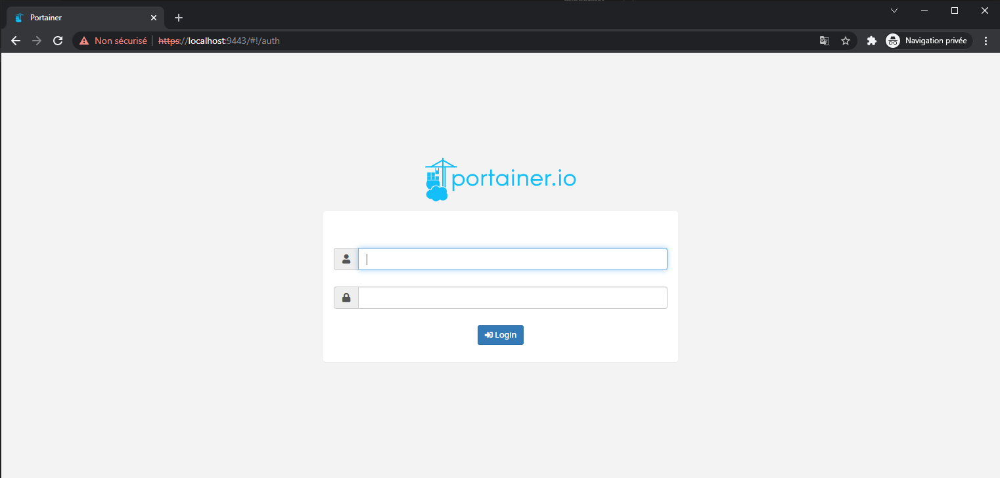
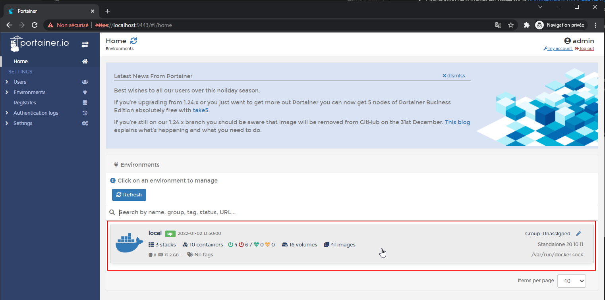
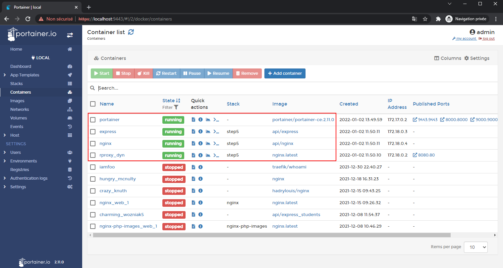

# Labo HTTP Infra

## Management UI

Hadrien Louis & Théo Mirabile

## Introduction

L'objectif de cette étape est de mettre en place un outil permettant d'administrer et de monitorer l'environnement Docker depuis une application web

## Portainer

Pour réaliser cela, nous avons choisi d'utiliser l'outil [Portainer](https://www.portainer.io).

> Portainer Community Edition (CE) is our foundation. With over half a million regular users, CE is a powerful, open source toolset that allows you to easily build and manage containers in Docker, Docker Swarm, Kubernetes and Azure ACI.

Comme vous pouvez le constater, Portainer est donc l'outil idéal pour réaliser cette partie. Voici comment nous l'avons installé

## Installation

- L'installation de Portainer est basée sur la [documentation offcicielle de Portainer](https://docs.portainer.io/v/ce-2.9/start/install/server/docker/linux). 
- Nous avons tout d'abord créé un script permettant de créer le volume associé à Portainer. Ce script s'appelle `create_volume.sh`
- Nous avons ensuite créé les deux scripts permettant de démarrer puis d'arrêter le container Portainer `start.sh` et `stop.sh`
- Une fois lancé, Portainer est en fait un nouveau container en cours d'exécution permettant de gérer tout l'environnement Docker (réseaux, volumes, images, conteneurs etc..)

## Lancement de Portainer

- Pour lancer portainer, il suffit de lancer le script `create_volume.sh` la toute première fois seulement puis `start.sh` pour chaque démarrage du container
- Une fois fait, il faut se rendre sur `localhost:9443` avec son navigateur
- Lors du premier lancement de Portainer, une petite phase de configuration est nécessaire. Grâce au volume créé, les données générées sont persistantes et tout sera mémorisé (identifiants de connexion et autres données générées depuis Portainer).

## Résultat obtenu

Page de login de Portainer

Une fois connecté, la page d'accueil nous montre l'environnement Docker local

Il est alors possible d'afficher la liste des containers en cours d'exécution. On s'aperçoit qu'il y a bel et bien 4 containers en cours d'exécution (nginx, express, reverse proxy et Portainer) 

Il est alors possible de gérer tout notre environnement depuis cette interface web.