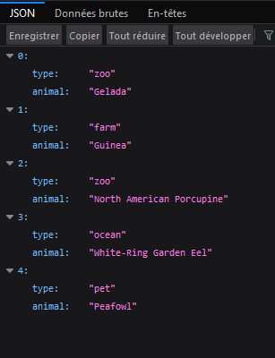

# Labo HTTP Infra

## Etape 2 : Serveur HTTP dynamique avec express.js

Hadrien Louis & Théo Mirabile

## Installation de node.js et de Chance.js

### Initialisation du projet npm

On crée tout d'abord un répertoire `src` qui contiendra les sources de notre application web.

On initialise ensuite un projet npm :

```sh
npm init
```

On peut donner un nom à notre projet, une version, un descriptif, le nom de notre point d'entrée, et d'autres informations. Dans le cas de ce labo, nous avons renseigné le nom et la version par défaut, ainsi que le nom de l'auteur.

## Installation de express.js

Pour installer express.js, il suffit d'exécuter cette commande dans le répertoire de notre projet npm :

```sh
npm install express
```

### Installation de Chance.js

Pour installer Chance.js, on lance la commande

```sh
npm install chance
```

dans le répertoire de notre projet npm (`src`).

## Création du Dockerfile et construction de l'image

Il faut tout d'abord créer un Dockerfile qui va effectuer les opérations suivantes :

- Récupérer la dernière version de l'image de node.js sur Docker Hub

- Copier les sources de notre application web sur le container

- Exposer le port 3000

- Lancer l'installation du projet avec npm. L'installation va se baser sur le fichier `package.json` qui contient les deux dépendances `express` et `chance` qui vont être intallées

- Demander à node de lancer l'application

Au final, le contenu du fichier Dockerfile est :

```Dockerfile
FROM node:16.13.1

WORKDIR ../
COPY ./src /opt/app

EXPOSE 3000

WORKDIR /opt/app
RUN npm install
CMD ["node", "/opt/app/index.js"]
```

On peut ensuite construire notre image Docker en exécutant la commande suivante, dans le même répertoire que celui du Dockerfile :

```sh
docker build -t api/express .
```

## Implémentation de l'application web

On doit tout d'abord créer nos variables afin d'instancier Chance.js et express.js :

```js
// Instanciation de Chance.js
let Chance = require("chance");
let chance = new Chance();

// Instanciation d'express.js
let express = require("express");
const { accepts } = require("express/lib/request");
let app = express();
```

Ensuite, on peut demander à express d'accepter les requêtes HTTP sur un port donné :

```js
// On demande à express d'écouter sur le port TCP 3000 afin d'y accepter des requêtes HTTP
app.listen(3000, function () {
  // On affiche un message dans la console pour confirmer que le serveur est lancé
  console.log("App started. Listening on port 3000...");
});
```

On va ensuite créer une fonction qui sera liée à la route racine, soit (`/`).
Cela signifie que si l'on effectue une requête HTTP sur la racine du serveur, cette fonction sera exécutée. Dans le cas présent, on souhaite exécuter la fonction `generateAnimals` qui est décrite par la suite.

```js
// Si la route racine est appelée, on exécute ce code
app.get("/", function (req, res) {
  // Retourne le résultat de la procédure generateAnimals
  res.send(generateAnimals());
});
```

Il ne reste plus qu'à implémenter cette fameuse fonction `generateAnimals` qui a pour effet de générer une liste d'animaux aléatoirement en utilisant Chance.js. Le contenu est généré au format JSON. Voici son implémentation commentée :

```js
/*
 * @brief Génère des noms d'animaux aléatoirement
 */
function generateAnimals() {
  // Le nombre d'animaux générés est sous la forme
  // d'un entier aléatoire entre compris entre 0 et 10
  var animalsCount = chance.integer({
    min: 0,
    max: 10,
  });

  console.log("The animals count is " + animalsCount);
  var animals = [];
  
  // liste de tous les types d'animaux possibles
  var types = ["ocean", "desert", "grassland", "forest", "farm", "pet", "zoo"];

  for (var i = 0; i < animalsCount; i++) {
    // Sélectionne un type d'animal aléatoirement dans la liste
    var randomType = types[Math.floor(Math.random()*types.length)];

    animals.push({
      type: randomType,
      animal: chance.animal({type: randomType}),
    });
  }

  // Affiche et retourne le résultat
  console.log(animals);
  return animals;
}
```

## Résultat obtenu

Une fois le container lancé et que l'on se rend sur `localhost:3000` avec son navigateur, on obtient bel et bien le résultat souhaité suivant :

