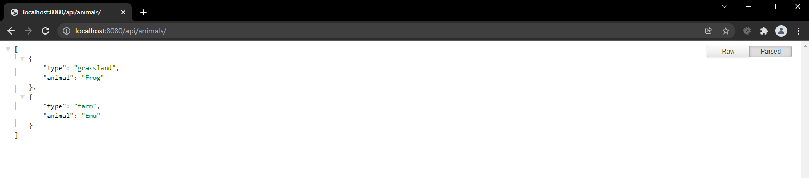
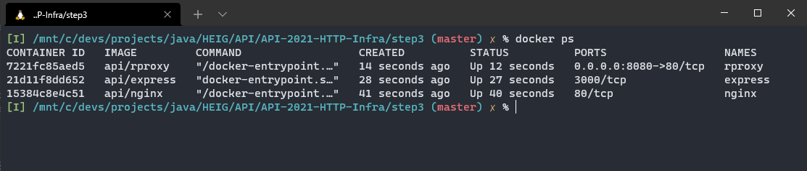

# Labo HTTP Infra

## Etape 3 : Reverse proxy avec nginx (configuration statique)

Hadrien Louis & Théo Mirabile

## Installation de node.js et de Chance.js

Pour le bon fonctionnement de cette étape, nous allons utiliser les 2 containers Docker créés durants les deux étapes précédentes du labo. Ces deux containers devront être démarrés au moyen du script `start_noport.sh` ce qui aura comme effet de ne pas mapper de port au container. Il sera alors impossible d'accéder au site. C'est le container du reverse proxy qui aura un port de mappé et qui se chargera de distribuer le contenu.

## Création du Dockerfile

Pour créer le reverse proxy nous allons à nouveau utiliser nginx. Pour ce faire, nous nous sommes basés sur le Dockerfile de l'étape 1 à la différence près que la configuration de nginx est maintenant située dans `/etc/nginx/conf.d/default.conf`. Au final, le contenu du fichier Dockerfile est :

```Dockerfile
FROM nginx:latest

EXPOSE 80

COPY ./conf/default.conf /etc/nginx/conf.d/default.conf
```

## Configuration nginx

Pour configurer un serveur nginx en mode reverse-proxy, il nous a suffi de définir deux configurations, chacune correspondant à une URI spécifique. Il faut ensuite utiliser l'instruction `proxy_pass`. Cette instruction permet d'indiquer d'agir en tant que proxy et de transmettre les requêtes avec le protocole HTTP vers les serveurs définis.

Nous avons donc défini 2 configurations :

- `/` qui pointe vers le site statique HTML sur le port 80 (étape 1)
- `/api/students/` qui pointe vers le site dynamique JS sur le port 3000 (étape 2)

```nginx
server {
    ...

    location /api/students/ {
        proxy_pass http://172.17.0.3:3000/;
    }

    location / {
        proxy_pass http://172.17.0.2/;
    }

    ...
}
```

Une grosse problématique avec cette configuration (qui sera améliorée par la suite durant les autres étapes du labo) est le fait que les adresses IP des deux sites (statique et dynamique) soient indiquées de manière fixe dans le fichier de configuration. Il est alors nécessaire de démarrer ces deux containers afin de connaître leur IP pour ensuite changer la config (si necessaire) du reverse proxy afin qu'il fonctionne correctement. Nous verrons par la suite comment améliorer ceci.

## Démarrer le reverse-proxy

Pour démarrer le revserse-proxy, il suffit de lancer le script `start.sh`. Ceci va avoir comme effet de mapper le port `8080`. Avant de faire ceci il faut avoir lancé au préalable les deux autres containers des sites statique et dynamique afin de connaitre leur IP et changer la config nginx si besoin.

## Résultat obtenu

Une fois les 3 containers lancés et que l'on se rend sur `localhost:8080` avec son navigateur, on obtient bel et bien les résultats suivants :

`localhost:8080`


`localhost:8080/api/students/`



Statut des containers docker. Cette image montre bien que seul le reverse proxy est accessible via le port mappé `8080` alors que les deux autres containers des sites statique et dynamique ne sont pas accessibles directement
