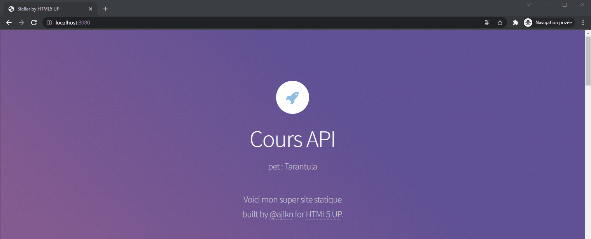
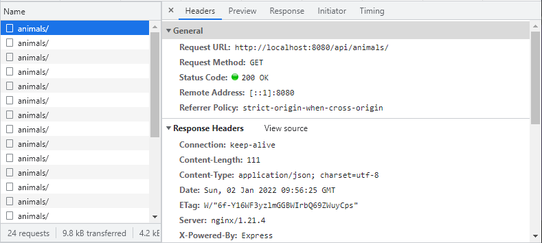
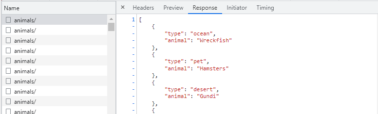
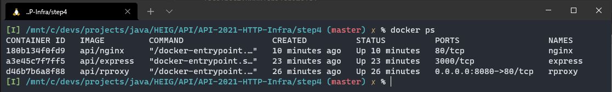

# Labo HTTP Infra

## Etape 4 : Requêtes AJAX avec jQuery

Hadrien Louis & Théo Mirabile

## Site web statique

Pour commencer, nous avons copié les sources du site web statique créé à l'étape 1 que nous allons modifier par la suite afin que nos deux containers dialoguent ensemble. L'objectif étant de faire en sorte que le site web statique fasse des requêtes `HTTP GET` à notre API (serveur express JS) et que la réponse à cette requête soit affichée sur le site statique.

## Modifications faites au site web statique

Les sources du site ayant été récupérée sur Internet, il nous a fallu trouver l'emplacement des fichiers JS. Ceux-ci se trouvent dans `src/assets/js`. Nous avons donc créé un nouveau fichier `animals.js` ayant le contenu suivant

```js
// Effectue les actions suivantes toutes les 2 sec
setInterval(async() => {

    // Effectue une requête GET à l'API
    const animals = await fetch('/api/animals/').then(response => response.json());
    
    // Récupère le premier élément de la réponse JSON
    let message = "Nobody is here"
    if (animals.length > 0) {
        message = animals[0].type + " : " + animals[0].animal
    }

    // Remplace le texte dans la div ayant comme ID "api-animals"
    document.getElementById("api-animals").innerHTML = message

}, 2000)
```

Comme vous pouvez le remarquer, nous avons plutôt utilisé la FetchAPI de JS plutôt que jQuery. Ceci est un choix personnel et les deux solutions fonctionnent parfaitement.

Nous avons également du modifier les sources de la page d'accueil du site afin de créer l'élément ayant comme ID `api-animals` pour permettre au résultat de s'afficher. Pour ce faire, nous avons simplement ajouté dans le fichier `src/index.html` le contenu suivant :

```html
<p id="api-animals"></p>
```

sans oublier d'ajouter dans ce même fichier le lien avec notre fichier JS afin de le charger

```html
<script src="assets/js/animals.js"></script>
```

## Lancement du projet

Comme lors de l'étape précédente, il est nécessaire de lancer les deux containers du site statique et dynamique avec `start_noport.sh` et le reverse proxy avec `start.sh`

## Résultat obtenu

Lorsque l'on se rend sur `localhost:8080`, on  obtient bien le résultat suivant :



Si l'on ouvre les `devtools`, nous pouvons voir les requêtes faites à l'API :



et la réponse obtenue :



Comme pour l'étape précédente, voici la liste des containers qui tournent sur la machine. On observe que seul le reverse proxy possède un port de mappé.

