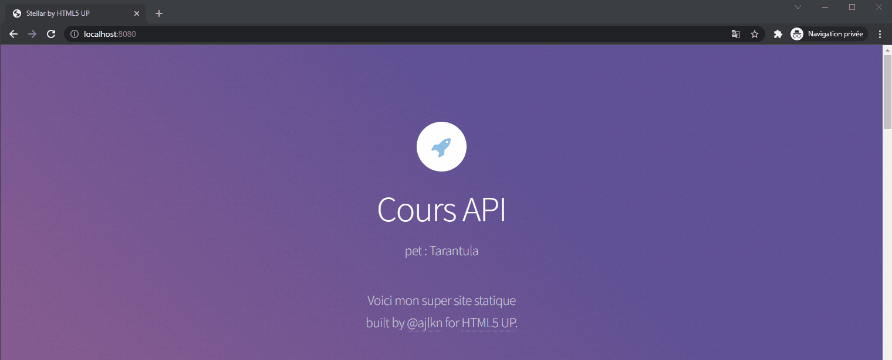
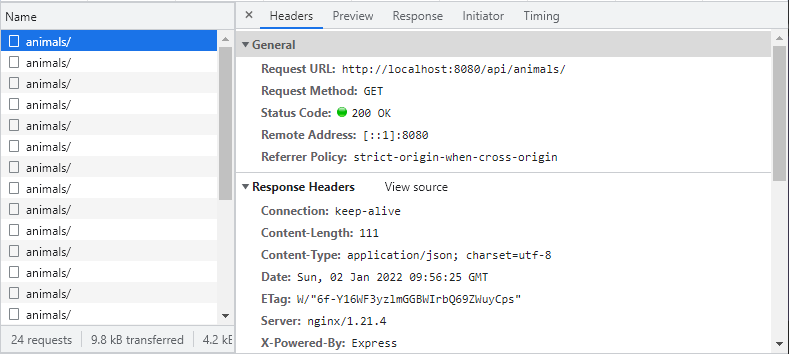
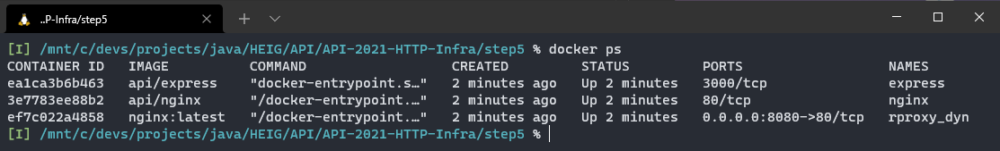
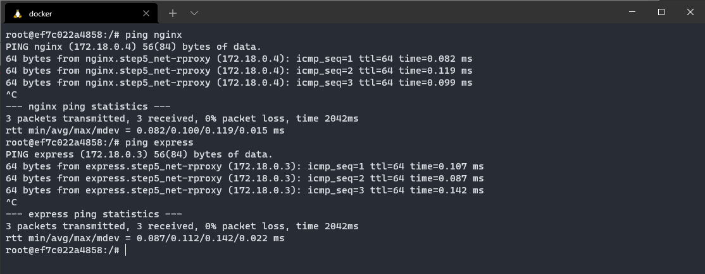
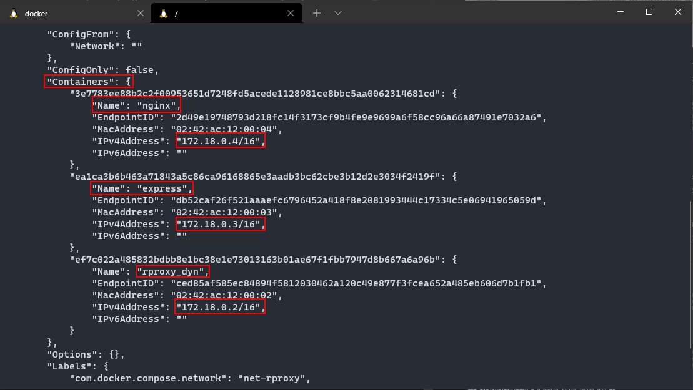

# Labo HTTP Infra

## Etape 5 : Configuration dynamique du reverse proxy

Hadrien Louis & Théo Mirabile

## Introduction

Contrairement à ce qui est proposé dans les diverses viédos du labo, nous n'avons pas utilisé Apache mais nginx et nous avons essayé de mettre en place une configuration un peu plus dynamique du reverse proxy que celle proposée dans les vidéos. En effet grâce à l'évolution de Docker durant les dernières années, il est possible grâce à `docker-compose` de mettre en place une infrastructure complètement dynamique.

## Configuration Docker

Comme annoncé ci-dessus, nous avons utilisé `docker-compose` pour cette étape du labo. Ceci va nous permettre de spécifier dans un seul fichier les divers containers à faire tourner. 

Dans le ficher `docker-compose.yml` on y trouve la déclaration des 3 services à faire tourner à savoir : `nginx`, `express` et le reverse proxy `rproxy`. Pour chaque service, nous déclarons la configuration suivante :

```yml
 rproxy:
    image: nginx:latest # Nom de l'image à utiliser
    container_name: rproxy_dyn # Nom du container
    volumes:
        - ./conf:/etc/nginx # Bind-mounts volume qui permet de mapper la config nginx
    ports:
        - "8080:80" # Mappage du port 8080 de la machine hôte vers le port 80 du container
    restart: always
    networks:
        - net-rproxy # Ajoute le container dans un sous-réseau nommé net-rproxy
```

d'autres instructions sont utiliées pour les services `express` et `nginx` :

```yml
depends_on: # Spécifie qu'un container dépend d'un autre
    - rproxy
build: # Spécifie le chemin vers un Dockerfile
    context: ../step4/
```

### Remarques

- L'instruction `build` est utilisée car en spécifiant les chemins des Dockerfile pour chaque service, il est possible de build toutes les images en une seule commande avec : `docker-compose build`
- L'utilisation de l'instruction `depends_on` n'est pas indispensable mais permet d'indiquer que des containers dépendent d'autres containers. Cela va notemment influencer leur ordre de démarrage
- L'avantage en utilisant `docker-compose` est que tous les containers démarrés depuis ce fichier sont connectés au même sous-réseau. Il est alors plus simple de les faire communiquer et de connaître leur IP qui sont toutes dans le même subnet

### Point important sur la doc Docker

Afin de mettre en place la configuration dynamique du reverse proxy, nous avons utilisé une fonctionnalité très importante de `docker-compose` décrite ci-dessous :

> When you run docker-compose up, the following happens :   
    - A network called myapp_default is created.   
    - A container is created using web’s configuration. It joins the network myapp_default under the name web.   
    - A container is created using db’s configuration. It joins the network myapp_default under the name db.   
Each container can now look up the hostname web or db and get back the appropriate container’s IP address. For example, web’s application code could connect to the URL `postgres://db:5432` and start using the Postgres database.

Cela signifie donc qu'en utilisant `docker-compose`, Docker va automatiquement gérer un mini DNS interne en faisant mapper les adresses IPs de chaque container avec le nom de leur service. Ceci est donc essentiel pour notre configuration car tout repose là dessus.

De plus, cela signifie qu'il n'y a donc rien à faire de notre côté car tout est géré par Docker. Cette configuration est donc 100% dynamique. Meme si un container est redémarré avec une autre adresse IP, la configuration fonctionnera toujours.

## Configuration nginx

Maintenant que nous avons vu que Docker tient à jour un mini DNS interne, nous pouvons reprendre la configuration nginx vue à l'étape 3. Il suffit simplement de remplacer les adresses IP par le nom de chaque service. La configuration ressemble donc à ceci :

```nginx
http {

    server {
        listen 80;

        location /api/animals/ {
            proxy_pass         http://express:3000/;
        }
 
        location / {
            proxy_pass         http://nginx:80;
        }
    }
}
```

Lorsque le reverse-proxy va vouloir transmettre la requête à un des serveur, il va interroger le DNS interne tenu à jour par Docker qui va lui soumettre l'IP du container.

## Lancement du projet

Pour lancer le projet, il suffit de lancer le script `start.sh` qui va simplement lancer un `docker-compose up` ce qui aura comme effet de lancer les 3 containers spécifiés dans le fichier `docker-compose.yml`

## Résultat obtenu

Lorsque l'on se rend sur `localhost:8080`, on  obtient bien le résultat suivant qui est équivalent au résultat de l'étape précédente. Cela siginifie donc que la configuration dynamique fonctionne correctement :



Si l'on ouvre les devtools, nous pouvons voir les requêtes faites à l'API :



Comme pour l'étape précédente, voici la liste des containers qui tournent sur la machine. On observe que seul le reverse proxy possède un port de mappé.


### Statut du DNS Docker

L'image ci-dessous montre des requêtes ping effectuées depuis le reverse proxy vers les deux sites statique et dynamique via leur nom respectifs. Cela montre que les noms `nginx` et `express` sont bien connus du DNS



De plus, en inspectant le statut du sous-réseau créé grâce au `docker-compose` en lançant la commande `docker network inspect step5_net-rproxy` on observe la configuration suivante :



On observe que le sous-réseau connaît bel et bien les 3 containers démarrés, leur nom et leur IP. L'image présente donc le contenu du DNS tenu à jour par Docker