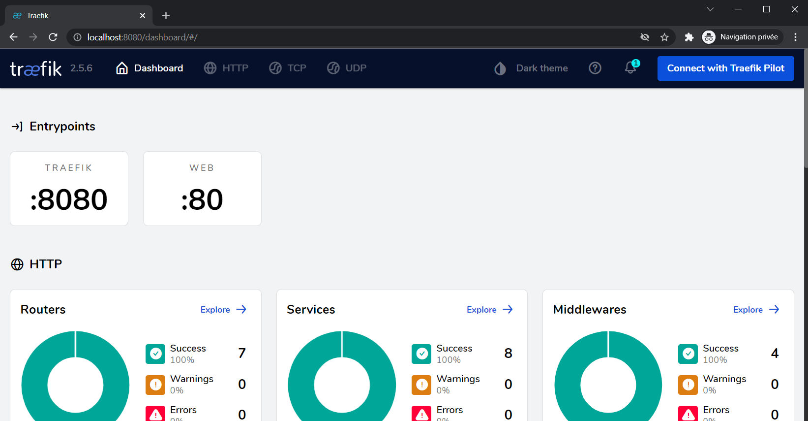
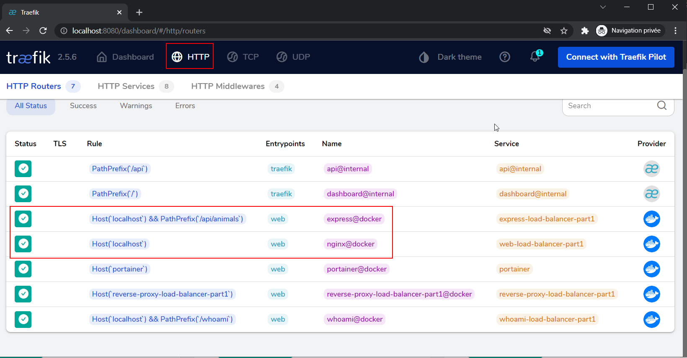

# Labo HTTP Infra

## Traefik

Hadrien Louis & Théo Mirabile

## Introduction

Pour la réalisation des deux étapes aditionnelles (Load balancing avec plusieurs noeuds et load balancing round-robin et sticky session), nous avons décidé d'utiliser Traefik comme load balancer. Nous avons fait ce choix car cet outil semble le plus pratique et le plus simple pour mettre en place les étapes suivantes.

Cette documentation va donc présenter la configuration de base de Traefik pour pouvoir ensuite faire les étapes suivantes.

## Installation

Pour utiliser Traefik, il suffit d'ajouter dans le docker-compose le service Traefik ainsi :

```yml
  reverse-proxy:
    image: traefik:v2.5
    command: 
      - --api.insecure=true 
      - --providers.docker=true
      - --entrypoints.web.address=:80
    ports:
      - "80:80"
      - "8080:8080"
    volumes:
      - /var/run/docker.sock:/var/run/docker.sock
    networks:
      - net-rproxy 
```

De plus, il est de bonne pratique mais pas nécessaire pour tous les autres services de spécifier une dépendance au reverse proxy ainsi :

```yml
depends_on:
    - reverse-proxy
```

Maintenant que Traefik est fonctionnel, il faut spécifier pour chaque service d'utiliser traefik comme reverse proxy.
Pour ce faire, il suffit dans le `docker-compose` d'ajouter les instructions suivantes dans `labels` :

Configuration pour le service nginx :
```yml
labels:
    - traefik.enable=true
    - traefik.http.routers.nginx.rule=Host(`localhost`)
    - traefik.http.routers.nginx.entrypoints=web
```

- L'instruction `Host('localhost')` va vérifier si le domaine de la requête (valeur du champ de l'en-tête HTTP host) vaut bien `localhost`

Configuration pour le service express :
```yml
labels:
    - traefik.enable=true
    - traefik.http.routers.express.rule=Host(`localhost`) && PathPrefix(`/api/animals`)
    - traefik.http.routers.express.middlewares=express-stripprefix
    - traefik.http.middlewares.express-stripprefix.stripprefix.prefixes=/api/animals
    - traefik.http.routers.express.entrypoints=web
```
- Contient aussi l'instruction `Host` comme pour la configuration nginx mais avec un `PathPrefix` supplémentaire. Cette instruction est utilisée car on souhaite matcher le chemin `/api/animals`. Comme l'indique la doc de Traefik, il faut utiliser un `Path` si on souhaite écouter sur un chemin particulier.
- L'instruction `stripprefix` est utilisée pour supprimer le prefix du chemin avant de transmettre la requête.

    La doc indique : 
    > Use a StripPrefix middleware if your backend listens on the root path (/) but should be exposed on a specific prefix.

    Ce qui correspond donc exactement à notre cas

## Résultat obtenu

Une fois le `docker-compose` lancé, il est alors possible d'accéder à l'interface de Traefik à l'adresse `localhost:8080`. 

On voit que l'on peut bien se connecter sur Traefik et que tous les services semblent tourner.



Si l'on se rend sur l'onglet `HTTP`, on voit nos deux services `nginx` et `express` dont le chemin est bien celui indiqué dans la config



Traefik est donc bien configuré et va nous permettre de mettre en place les deux étapes additionnelles.

